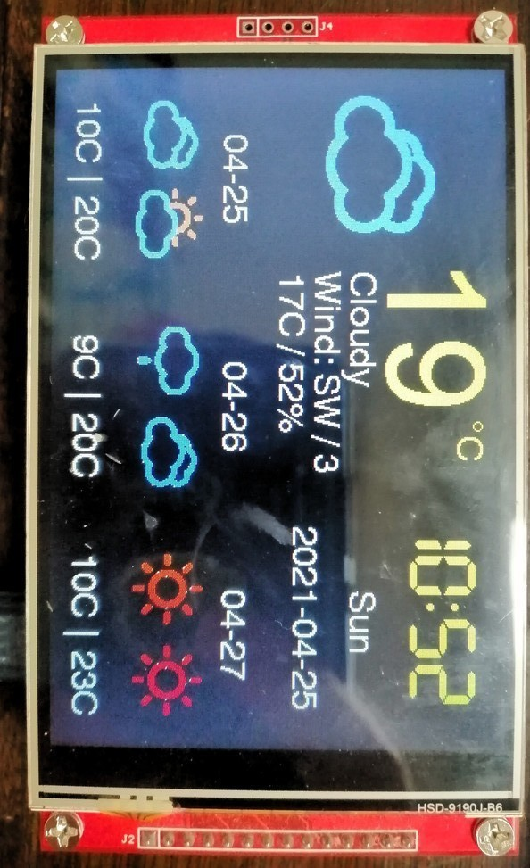
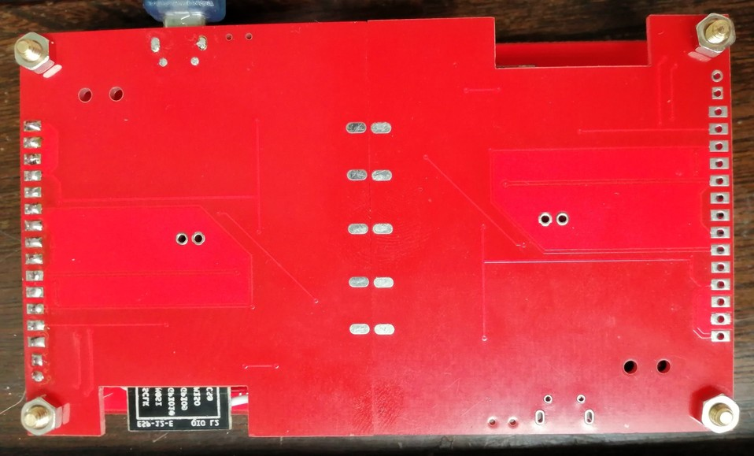
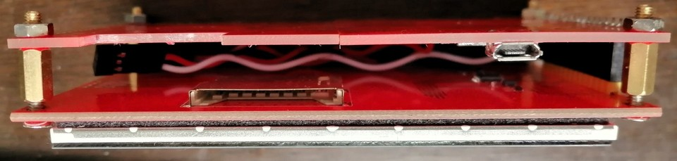

# esp-12_tft4.0

 
 
 

## important
1. it needs modify 'HEFENG_KEY' in 'sw/esp-tft4.0/esp-tft4.0.ino' file.
2. update 'data' folder date in aruino ide.
3. download below 'libs' into 'Arduino/libraries' folder.
4. use 'sw/tft_espi_setup/User_Setup.h' file replace TFT_eSPI folder file.

## hardware
### bom
| No. | Name | Description
| :---: | :---: | :--- |
|1    | esp-12e | |
|2    | st7796s | 320 x 480 |

### connect
| No. | st7796s | esp-12e
| :---: | :---: | :--- |
|1    | T_IRQ | GPIO5(D1)|
|2    | T_DO | GPIO12(D6) |
|3    | T_DIN | GPIO13(D7) |
|4    | T_CS | GPIO4(D2) |
|5    | T_CLK | GPIO14(D5) |
|6    | SOD(miso) | GPIO12(D6) |
|7    | LED | 3V3 |
|8    | SCK | GPIO14(D5) |
|9    | SDI(mosi) | GPIO13(D7) |
|10    | D/C | GPIO2(D4) |
|11    | RESET | 3V3 |
|12    | CS | GPIO15(D8) |
|13    | GND | GND |
|14    | VCC | 3V3 |

## software
### ENV
| No. | Name | Ver | Des
| :---: | :---: | :--- |:--- |
|1    | ubuntu | 18.04 | os |
|2    | arduino | 1.8.10 | ide |

### libs
| No. | Name | Ver | link | remark
| :---: | :---: | :--- |:--- |:--- |
|1    | wifimanager | 8c3d0dc | https://github.com/bibo19842003/WiFiManager.git | |
|2    | TFT_eSPI | 5b78211 | https://github.com/bibo19842003/TFT_eSPI.git | |

## Thanks
| No. | Name | link | remark
| :---: | :---: | :--- | :--- |
|1    | WiFiManager | https://github.com/tzapu/WiFiManager | |
|2    | TFT_eSPI | https://github.com/Bodmer/TFT_eSPI | |
|3    | Esp8266_NTP_Clock_Weather | https://github.com/yuan910715/Esp8266_NTP_Clock_Weather | |
|4    | https://www.jianshu.com/p/c08e02d83895 | https://www.jianshu.com/p/c08e02d83895 | |
|5    | nodemcu-devkit-v1.0 | https://github.com/nodemcu/nodemcu-devkit-v1.0 | |
